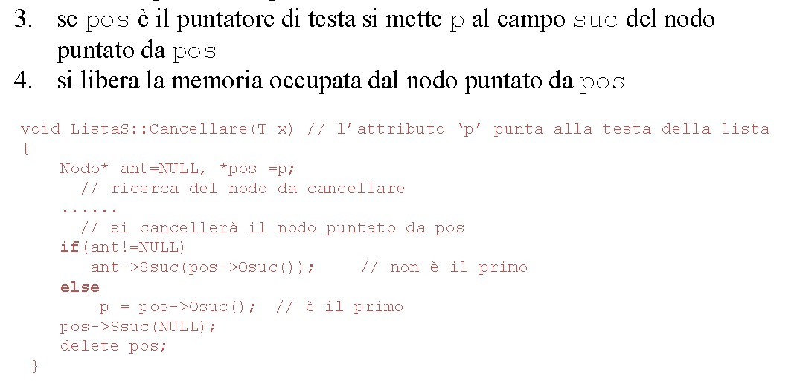

# **CHEATSHEET LISTE PILE CODE ALBERI**

***

## **Nodi**
  
Variano a secondo della struttura dati che si sta usando.  
Es: **Nodi per liste semplici** vs **nodi per liste doppiamente concatenate** vs **nodi di alberi** vs **nodi di grafi**.

<details><summary> <h2><b>NODI</b></h2></summary>

### **Nodo semplice (template)**

```cpp
template <typename T>
class Node{
    private:
        T data;
        Node * succ; 
    public:
        Node(T _d): data(_d), succ(nullptr){};
        
        //getters
        T getData(){
            return this->data; 
        }
        Node * getSucc(){
            return this->succ; 
        }

        //setters
        void setData(T x){
            this->data = x; 
        }
        
        void setSucc(Node * myNode){
            this->succ = myNode; 
        }

};
```

***

### **Nodo doppiamente linkato**

```cpp
template <typename T>
class DLNode{
    private:
        T data;
        Node * succ; 
        Node * prev; 
    public:
        Node(T _d): data(_d), succ(nullptr), prev(nullptr){};
        Node(){ this-> succ = nullptr;}; 
        
        //getters
        T getData(){
            return this->data; 
        }
        Node * getSucc(){
            return this->succ; 
        }
        Node * getPrev(){
            return this->prev; 
        }

        //setters
        void setData(T x){
            this->data = x; 
        }
        
        void setSucc(Node * myNode){
            this->succ = myNode; 
        }

        void setPrev(Node * myNode){
            this->prev = myNode; 
        }

};
```
</details>

***

## **Liste**
  
Tipi di liste:  

* **Semplice** (i nodi hanno solo un successore)
* **Doppiamente concatenata** (ogni nodo ha un predecessore)
* **Circolare** (l'ultimo elemento è collegato al primo in modo che la lista possa essere attraversata in maniera, appunto, circolare)


<details><summary><h2><b>LISTE</b></h2></summary>

## **Lista Semplice**

Necessita di:  

* **Nodo di testa** (Quello iniziale a cui il resto punta)
* **Costruttore()** ed eventuale distruttore()
  * Possiamo inizializzarla con la head in nullptr e poi successivamente fare gli Insert() per riempirla
* **Inserimento()** (eventuale Inserimento in posizione, in testa, in coda)
  * **Inseriemento in testa**:
    1. Creo puntatore a nodo -> ```Nodo * nuovo_ptr;```
    2. Alloco dinamicamente il nodo -> ```nuovo_ptr = new Nodo;```
    3. Assegno il contenuto al nodo -> ```nuovo_ptr->setData(KEY);```
    4. Faccio in modo che il successore di questo nodo sia la testa -> ```nuovo_ptr->setSucc(head);```
    5. Faccio in modo che la testa diventi il nuovo nodo -> ```head = nuovo_ptr;```<br>
  * **Inserimento in posizione**  
    1. Creo puntatore a nodo -> ```Nodo * nuovo_ptr;```
    2. Alloco dinamicamente il nodo -> ```nuovo_ptr = new Nodo;```
    3. Assegno il contenuto al nodo -> ```nuovo_ptr->setData(KEY);```
    4. Faccio puntare il puntatore al successore del nuovo nodo allo stesso successore del nodo che deve essere il predecessore del nuovo nodo -> ```nuovo_ptr->setSucc(ant_ptr->getSucc());```
    5. Faccio in modo che il predecessore del nuovo nodo abbia effettivamente come successore il nuovo nodo -> ```ant_ptr->setSucc(nuovo_ptr);``` 
* **Ricerca()**
  1. ```Search(T valore)```  ritorna un puntatore a nodo
  2. Creo puntatore alla TESTA -> ```Nodo * nuovo_ptr = head;```
  3. Ciclo while che, finché il nuovo nodo sia diverso da nullptr, passa da sé al suo successivo. Se il VALORE di uno dei nodi per cui passa è uguale al VALORE che sta cercando, ritorna il nuovo nodo e interrompe il ciclo. Altrimenti ritorna nullptr.

```cpp
    while(nuovo_ptr!=nullptr){
        if(nuovo_ptr->getData()==valore){
            return nuovo_ptr;
        } 
    nuovo_ptr = nuovo_ptr->getSucc(); 
    } 
    return nullptr;
```

* **Cancellazione()**
    1. Creare due puntatori a nodo -> ```Nodo * ant=nullptr;``` e --> ```Nodo *pos =p;```
    2. Ricerca del nodo che contiene il dato da cancellare: farlo puntare dal puntatore a nodo pos -> ```pos = Search(x); ``` e controllare che non sia NULLPTR
    3. Collegare il puntatore SUCC del nodo puntato da ant al puntatore SUCC del nodo puntato da pos 
    

</details>

** WORK IN PROGRESS **