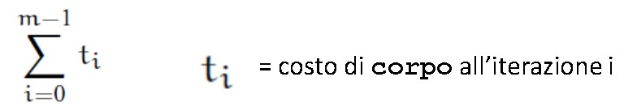
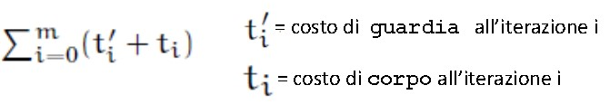
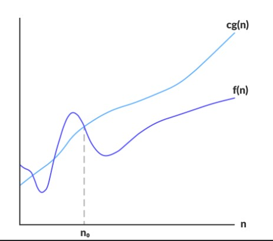
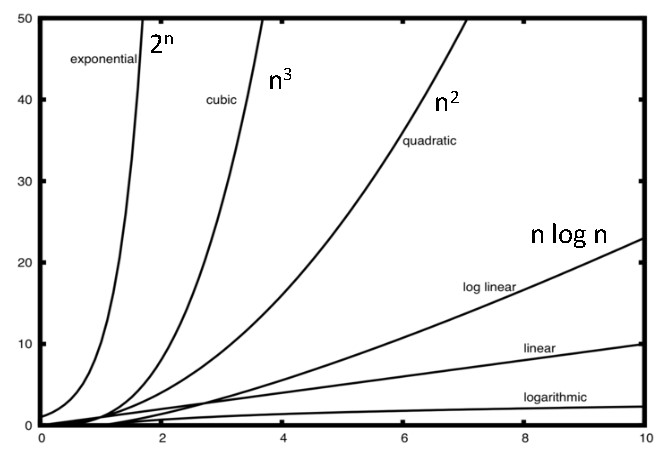
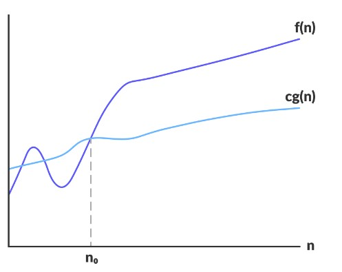
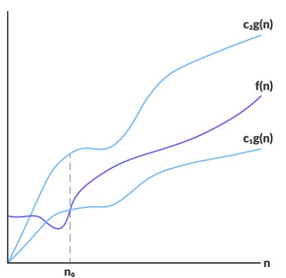
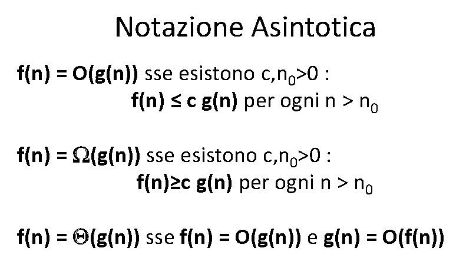
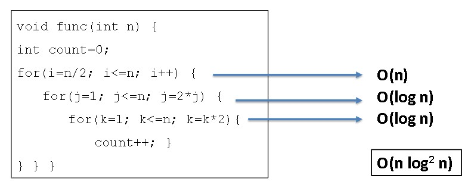
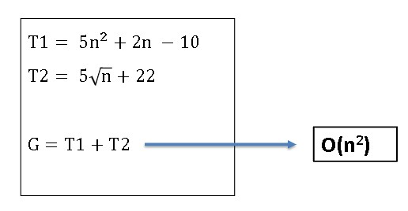
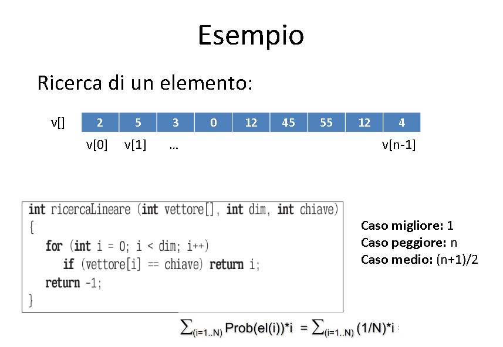

# Complessità

## Analisi di Complessità

    --> Costo di un algoritmo si misura in termini di TEMPO (numero di operazioni RAM eseguite) e SPAZIO (numero di celle di memoria utilizzate)

***

```
    if (guardia){
        BLOCCO 1
    } else {
      blocco 2
    }
```

**costo** = costo(guardia) + max {costo(blocco1), costo(blocco2)}

***

```
    for(i = 0; i < m; i++){
        corpo
    }
```

***costo** = 

***

```
    while(guardia){
        corpo
    }

    do {corpo} while (guardia)
```

**costo** = 

***

* Il costo di una funzione è dato dal costo del suo corpo (più il passaggio dei parametri). Per le funzioni ricorsive, le cose si complicano.

* ==Il costo di una sequenza di istruzioni è la somma dei costi delle istruzioni nella sequenza==

***

## Caso pessimo e caso medio

Complessità (o costo computazionale) **f(n)** in tempo e spazio di un problema **P** 

* **caso peggiore** = costo MASSIMO tra TUTTE le istanze di **P** aventi dimensioni dei dati pari ad n

* **caso medio** = costo **mediato** tra tutte le istanze di **P** aventi dimensioni pari ad n

## Complessità temporale

**1° Ipotesi semplificativa:** Tempo impiegato proporzionale al numero di operazioni eseguite (ciascuna di costo unitario)

**2° Ipotesi semplificativa:** Stabilire il comportamento asintotico della funzione ==quando le dimensioni dell'ingresso tendono ad infinito== (comportamento asintotico dell'algoritmo)

**

# Notazione Asintotica

Viene valutato come i parametri di tempo (o spazio) e le risorse utilizzate varino al crescere della dimensione dell'input. 

## NOTAZIONE ASINTOTICA "BIG-O" / "O-GRANDE"

    **O(g(n))** è l'insieme delle funzioni

O(g(n)) = {f(n) : esistono delle costanti positive c, n<sub>0</sub>; tali che 0 <= f(n) <= c*g(n) per ogni n>n<sub>0</sub> }

O(g(n)) è un insieme.

Possiamo scrivere interscambiabilmente f(n) ∈ O(g(n)) 
    oppure f(n) = O(g(n)).

**f(n) = O(g(n))** se e solo se esistono c, n<sub>0</sub> > 0
    TALI CHE **f(n) <= c g(n)** per ogni n > n<sub>0</sub>.



Per n sufficientemente grande, il tasso di crescita f(n) è al più proporzionale a g(n). (?)

La notazione O-Grande ==definisce un limite superiore== per f(n).

Gli algoritmi vengono divisi quindi in classi di equivalenza, ==ponendo nella medesima classe tutti quelli la cui complessità asintotica è dello stesso ordine di grandezza.== 

***

---> Funzioni: **Costante**, **Sottolineare** log n, n <sup>c</sup> con c<1, **Lineare** n, **Polinomiale** n*log n, n<sup>2</sup>, ..., n<sup>c</sup> con c>1, **Esponenziale** c <sup>n</sup>, n<sup>n</sup> 
***
**Funzione costante**
: f(n) = c   { con c costante}

**Funzione Logaritmica**
: f(n) = log <sub>b</sub> n  *(con b>1)*
: 1.  x = log<sub>b</sub>n (n)  <=> b <sup>x</sup> = n
: 2.  log <sub>b</sub>(1) = 0

**Funzione lineare**
: f(n) = c*n  { con c costante non nulla}

**Funzione n log n**
: f(n) = n log n

**Funzione esponenziale**
: f(n) = b <sup>n</sup>
:
: Regole:
: (b<sup>a</sup>)<sup>c</sup> = b<sup>a c</sup>
: b <sup>a</sup> * b <sup>c</sup> = b<sup>a+c</sup>
: b<sup>a</sup> / b<sup>c</sup> = b<sup>a-c</sup>

**Funzione Polinomiale**
: f(n)= a<sub>0</sub> + a<sub>1</sub> n + a<sub>2</sub> n<sup>2</sup> + ... + a <sub>d</sub> n <sup>d</sup>
:il grado è il valore della potenza più grande con a<sub>d</sub> diverso da 0

**Funzione Quadratica**
: f(n) = c n<sup>2</sup>

```c++
    for(i = 0; i<n; i++){
        for(i = 0; j<n; j++){
            [do something]
        }
    }
```

**Funzione Cubica**
: f(n) = c n<sup>3</sup>

```c++
     for(i = 0; i<n; i++){
        for(i = 0; j<n; j++){
            for(k=0; k<n; k++){
                [do something]
            }
        }
    }
```

***

### Notazioni in ordine crescente
 f(n)
1   <   log n   < sqrt(n)   <   n   <   n log n <   n<sup>c</sup>   <   c<sup>n</sup>

(con c > 1)



* **NOTA** : si considera la delimitazione superiore più piccola possibile tra quelle per cui esso è delimitato superiormente.


## Notazione Asintotica "Omega-Grande"

**f(n) = omega(g(n))** se e solo se esistono c, n<sub>0</sub> > 0; TALI CHE
**f(n) >= c g(n)** per ogni n > n <sub>0</sub>



--> Essa definisce un limite inferiore per f(n). Per tutti i valori maggiori di n<sub>0</sub>, il valore di f(n) coincide o sta sopra *c g(n)*.

## Notazione Asintotica "Theta-Grande"

**f(n) = Theta(g(n))** se e solo se esistono delle costanti positive c<sub>1</sub>, c<sub>2</sub> e n<sub>0</sub> TALI CHE
0   <=   c<sub>1</sub> g(n)  <=  **f(n)**   <= c<sub>2</sub> g(n)
(Per ogni n > n<sub>0</sub>.

in altre parole, f(n) ∈ O(g(n)) && g(n) ∈ O(f(n))
-> f(n) è limitata sia superiormente che inferiormente. 



***


***

1. Se **f(n) = O(g(n))** allora **a ⋅ f(n) = O(g(n))** per ogni costante a
2. Se **f(n) = O(g(n))** e **g(n) = O(h(n))** allora **f(n) = O(h(n))**

^-- vale anche per Omega-grande e Theta-grande.

***

## Delimitazioni alla complessità di P

Per un problema consideriamo un algoritmo A che lo risolve. 

* Se A prende tempo **t(n)** diremo che **O(t(n))** è un **limite superiore**
* Se riusciamo a provare che nessun algoritmo può fare meglio di t(n) diremo che **Omega(t(n))** è un **limite inferiore**
* A è ottimo se i due limiti coincidono. In tal caso la complessità computazionale del problema è **Theta(t(n))**
  

* Un algoritmo A che risolve un problema P è **ottimale** se: 
  1. P ha complessità **Omega(f(n))**
  2. A ha complessità **O(f(n))**

***

## ***---> Esempi pratici di Analisi di Algoritmi <---***

### **O(1)**
Complessità di una funzione o blocco di istruzioni ciascuna del costo **O(1), che non contengono cicli, ricorsioni, o chiamate a funzioni non costanti. 


### **O(n)**
Complessità di un ciclo quando le sue variabili (es contatore) sono incrementate/decrementate di una quantità costante.

```c++
    //c è una costante positiva
    for(int i = 0; i <=n; i+=c){
        //espressioni con costo O(1)
    }
```


### **O(n<sup>c</sup>)**
La complessità di cicli annidati è uguale al numero di volte in cui le istruzioni del ciclo interno vengono eseguite. 

```c++
    // O(n^2), c è una costante positiva
    for(int i = 0; i <=n; i+=c){
        for(int j = 0; j <=n; j+=c){
            //espressioni con costo O(1)
        }
    }
```

### **O(Log n)**
Complessità di un ciclo quando le sue variabili sono incrementate/decrementate moltiplicandole o dividendole per una costante. 

```c++
    //c è una costante positiva
    for(int i = 1; i <=n; i*=c){
        //espressioni di costo O(1)
    }
```

### **O(Log Log n)**
Complessità di un ciclo quando le sue variabili sono incrementate/decrementate esponenzialmente

```c++
    //c è una costante positiva > 1
    for(int i = 2; i <= n; i = pow(i, c)){
        //espressioni con costo O(1)
    }
```

***
### Esempi di calcolo di complessità





