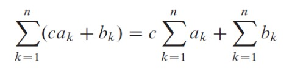
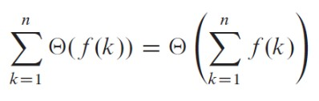
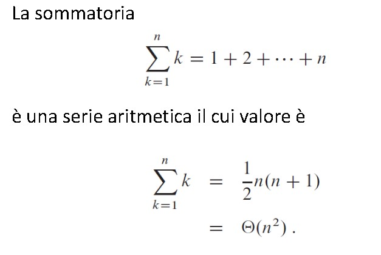
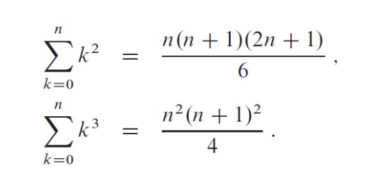
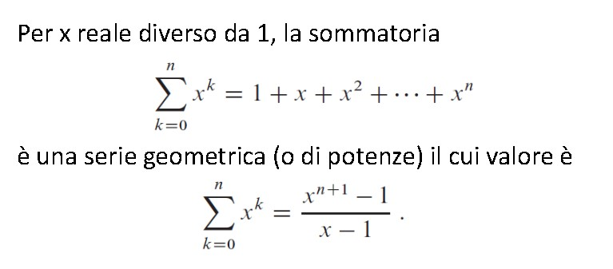
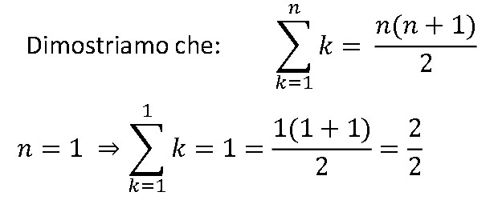

# **Complessità parte 2**

**Divide** 
: dividere il problema in sottoproblemi (istante più piccole *dello stesso problema*)

**Impera**
: risolvere i sottoproblemi ricorsivamente 

**Combina**
: combinare le soluzioni dei sottoproblemi ottenendo la soluzione del problema originale

## Relazioni di ricorrenza
Esse descrivono in maniera precisa le prestazioni degli algoritmi ricorsivi. 

***

***

## **SOMMATORIE**

--> Quando l'algoritmo contiene un ciclo, il suo tempo può essere espresso come **sommatoria** dei tempi impiegati in ogni esecuzione del corpo del ciclo. 

### **Sommatorie - Linearità**

Per qualsiasi reale **c** e due sequenze finite *a1, ..., an* e *b1, ..., bn*, si ha: 

La linearità si applica anche alle sommatorie che includono termini asintotici: 

***

### **Sommatorie - Serie aritmetiche**

Serie *"gaussiana"*, sommatoria di k che va da 1 a n è uguale a n ⋅ (n+1)/2, che viene uguale a Theta ⋅ (n2).

***

### **Sommatorie - Quadrati e Cubi**

***

### **Sommatorie - Serie Geometriche**

***

### **Sommatorie - Serie armoniche**

***

## ***Limitare le sommatorie***

Il metodo principale per calcolare il valore di una serie consiste nell’utilizzare l’induzione matematica.

***

--> dalla slide 21 <--